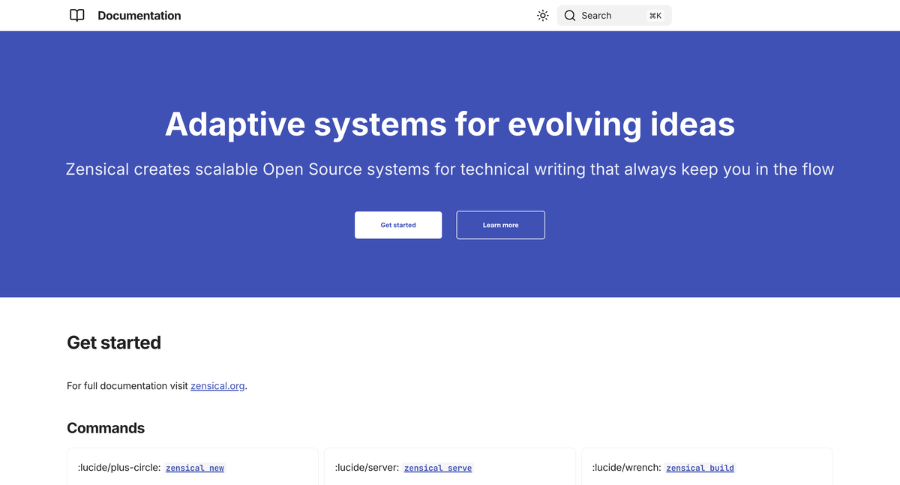
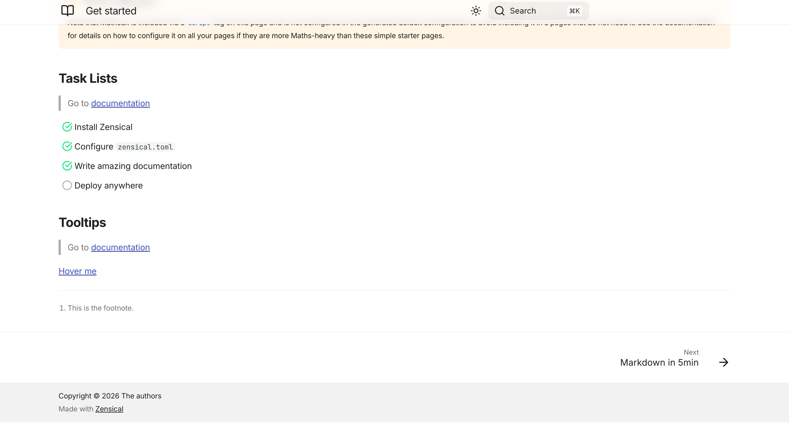

# CHE-8: Update the Homepage Walkthrough

## Narrative Summary

**The Problem**
The project's homepage was a standard documentation page that lacked a professional "landing page" feel. It didn't effectively highlight the project's value proposition or provide a clear path for new users to get started, especially compared to the reference site, `zensical.org`.

**The Solution**
To address this, I implemented a custom hero section using Zensical's template override system and restructured the homepage content into more visual components. By leveraging the `home.html` template and frontmatter configurations, I created a layout that mimics the high-quality aesthetics of the reference site while preserving all existing documentation content.

**Key Changes**
- **Hero Section**: Added a bold hero section in `overrides/home.html` featuring a primary "Get started" call-to-action and a secondary "Learn more" link.
- **Content Layout**: Transformed the "Commands" list into a responsive feature grid using `grid cards` and reorganized the "Examples" section into a structured 2-column layout.
- **Configuration**: Updated `zensical.toml` to enable custom template overrides and adjusted `docs/index.md` frontmatter to hide standard navigation elements, ensuring the hero section takes center stage on the homepage.

## 🎬 Visual Storyboard

1. **Hero Section**: The top of the homepage now features a professional hero section with a clear value proposition and primary/secondary call-to-action buttons.

   

2. **Commands Grid**: The standard list of CLI commands has been restructured into a responsive feature grid with clear icons and descriptions.
   

3. **Examples Grid**: Existing documentation examples (Admonitions and Details) are now organized into a clean, 2-column grid layout for better information density.
   
