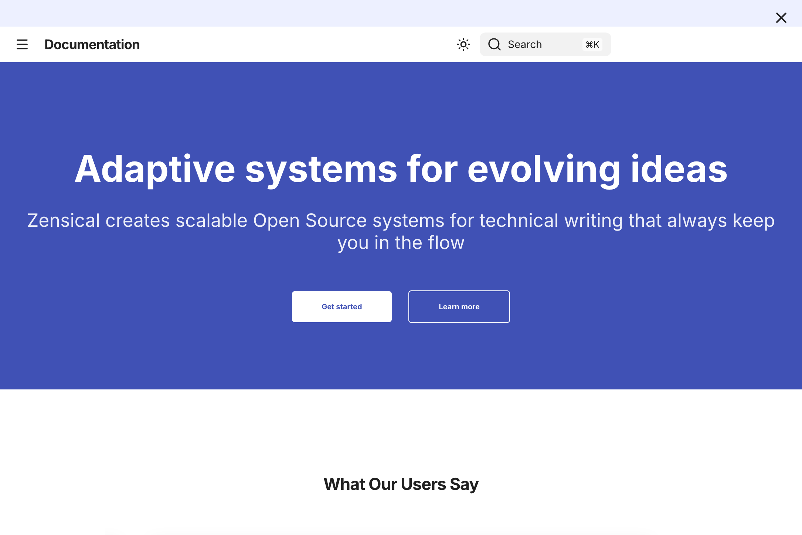
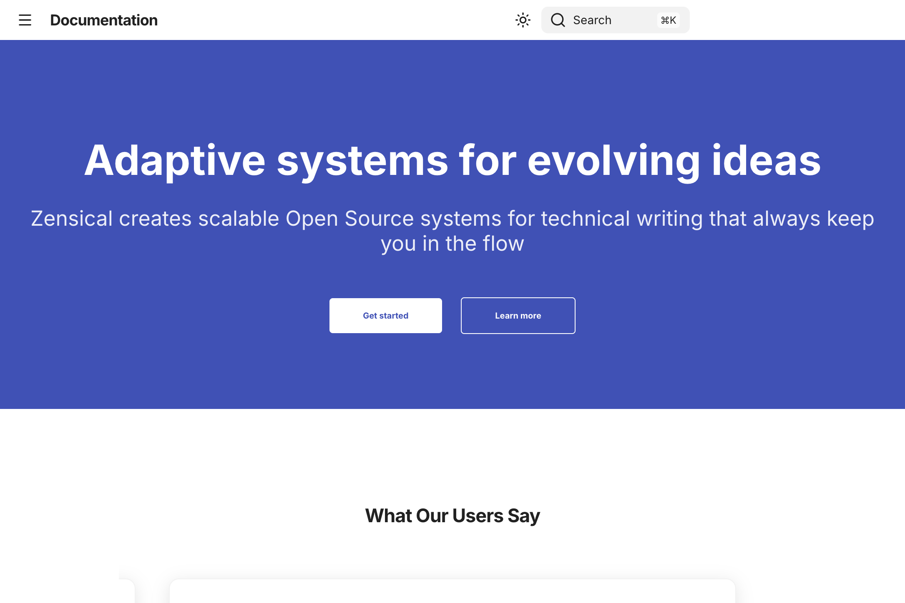

# Walkthrough - YAML-driven Announcement System (CHE-19)

## Narrative Summary

### The Problem
Previously, announcements on the site were hardcoded, making them difficult to manage and update. There was no built-in way to schedule announcements or manage multiple messages without manual code changes and redeployments.

### The Solution
We implemented a dynamic, YAML-driven announcement system. It consists of a Python plugin that parses a root-level `announcements.yaml` file and a client-side JavaScript component that handles real-time filtering based on dates. This allows for "set and forget" scheduling on a static site.

### Key Changes
- **Announcements Plugin**: A new Zensical plugin that processes `announcements.yaml` into a JSON asset.
- **Dynamic Frontend**: `announcements.js` fetches the latest announcements and displays only those that are currently active.
- **Improved UX**: Added a dismissal feature with a "Don't show this again" button that persists via `localStorage`.
- **Custom Styling**: Support for per-announcement background colors and rich HTML content.

## 🎬 Visual Storyboard

1. **Active Announcement**: The announcement bar appears at the top of the page with the scheduled content and custom color.
   

2. **Dismissal**: Users can dismiss the announcement bar, and the preference is saved locally to keep the UI clean on subsequent visits.
   
