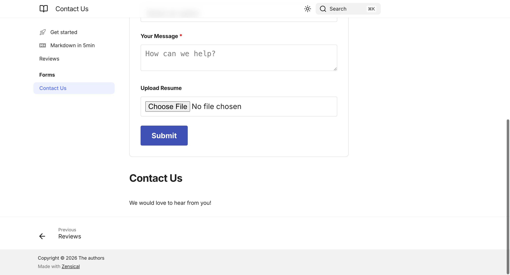
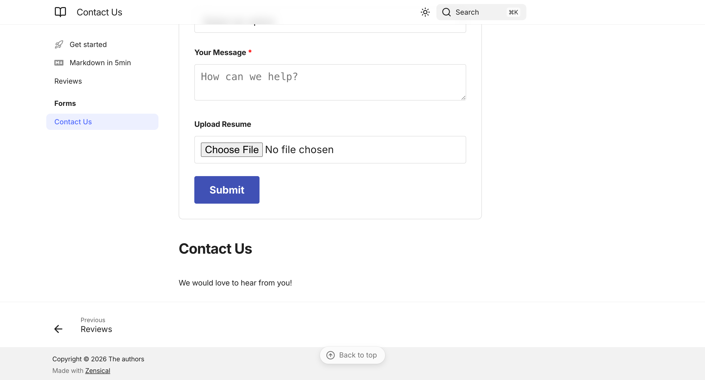
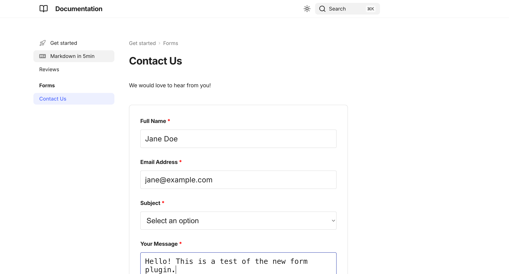

# Walkthrough - Form Plugin (CHE-17)

## Narrative Summary

### The Problem
The goal was to create a flexible, YAML-configurable form plugin for Zensical/MkDocs. Previously, adding forms required manual HTML/JS work for each page. There was also a need for built-in security features like reCAPTCHA v3 and Honeypot fields to prevent SPAM.

### The Solution
We implemented a `form_plugin` that follows the existing "Generator" pattern in the project. It automatically scans a `forms/` directory for YAML configurations and generates corresponding Markdown pages. A custom Jinja2 template (`overrides/form.html`) provides a clean, responsive UI, while a dedicated JavaScript handler (`form_submission.js`) manages AJAX submissions to any external webhook.

### Key Changes
- **Plugin Logic**: Created `form_plugin/plugin.py` to bridge YAML configs with MkDocs pages.
- **Dynamic UI**: Developed an overridable Jinja2 template that supports various field types (text, email, select, textarea, file).
- **Security**: Integrated reCAPTCHA v3 and a hidden Honeypot field directly into the form structure.
- **Robust Submission**: Added client-side validation for file sizes and extensions before the data is sent to the webhook.

## 🎬 Visual Storyboard

### Summary Animation

### 1. Form Overview
The form is rendered with a clean, modern layout that fits the site's theme. All fields defined in YAML are automatically generated with proper labels and validation.

### 2. File Uploads & Security
The bottom section of the form includes a "Your Message" area, a file upload input with extension filtering, and the secure "Submit" button.

### 3. Interactive State
Users get immediate feedback as they fill out the form. The "Submit" button triggers the reCAPTCHA token generation and AJAX submission flow.

